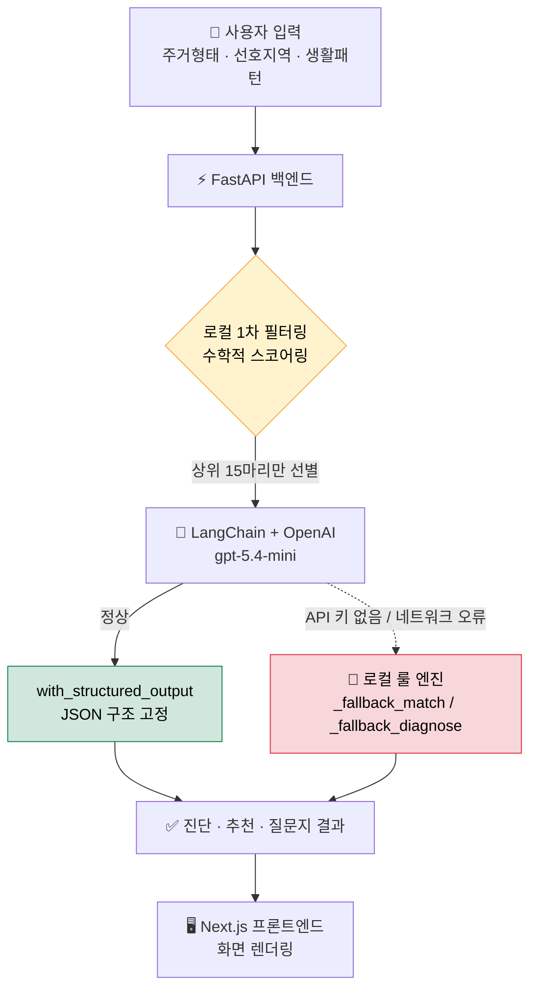

# 🐾 Pawinhand Clone

> **유기동물 입양, "탐색"에서 "행동"으로.**
> AI가 입양 적합도를 진단하고, 나에게 꼭 맞는 보호소 동물을 추천하며, 상담용 질문지까지 만들어주는 입양 매칭 MVP 서비스.

<p align="center">
  
  
  
  
  
</p>

---

## 💡 우리가 풀려는 문제 (Value Proposition)

기존 유기동물 입양 서비스는 대부분 "동물 목록을 구경하는 것"에서 멈춥니다.
하지만 정작 입양을 망설이는 사람들의 진짜 고민은 따로 있습니다.

> *"내가 지금 사는 환경에서 정말 이 아이를 키울 수 있을까?"*
> *"이 많은 동물 중에 나랑 맞는 아이는 대체 누구지?"*
> *"보호소에 가서 뭘 물어봐야 하지?"*

**Pawinhand Clone**은 이 고민을 3단계로 좁혀 실질적인 입양과 상담(행동 유도)까지 이어지도록 돕습니다.

| 단계 | 무엇을 하나요 | 사용자가 얻는 것 |
|---|---|---|
| 🩺 **진단 (Diagnose)** | 주거 형태·생활 패턴을 입력하면 AI가 입양 적합도를 진단 | "나 입양해도 될까?"에 대한 객관적 답 |
| 🎯 **추천 (Match)** | 조건에 가장 잘 맞는 보호소 동물을 맞춤 추천 | 수백 마리 중 나에게 맞는 후보 압축 |
| 📋 **상담 (Consult)** | 입양 상담 시 활용할 맞춤 질문지 자동 생성 | 보호소 방문 시 바로 쓰는 체크리스트 |

---

## 🛠 기술 스택

| 구분 | 기술 | 비고 |
|---|---|---|
| **Frontend** | Next.js (npm) | Tailwind 대신 **Vanilla CSS**로 레이아웃 직접 구성 |
| **Backend** | FastAPI | Python 3.12 |
| **패키지/가상환경** | Poetry | 로컬 가상환경 폴더 `.venv` 사용 |
| **AI & LLM** | LangChain + OpenAI `gpt-5.4-mini` | 구조화 출력 · RAG 파이프라인 |
| **데이터** | `animals.json` (고정 파일) | MVP 단계라 DB 없이 데모 데이터로 대체 |
| **배포** | Railway | — |

> 💬 **한 줄 설명**
> - **FastAPI**: 프론트엔드(화면)가 데이터를 요청하면 답을 돌려주는 "백엔드 서버(주방)"예요.
> - **LangChain**: AI에게 일을 시키는 과정을 정리해주는 "AI 작업 매니저"라고 생각하면 됩니다.
> - **RAG**: AI가 우리 동물 데이터를 "참고 자료로 보고" 답하게 만드는 방식이에요.

---

## 🧭 아키텍처 흐름도

사용자의 요청이 어떻게 처리되는지, 특히 **속도 최적화**와 안전판(Fallback)이 어디서 동작하는지를 표현했습니다.



---

## ⭐ 핵심 기술 특징

### 1. 속도 최적화 (Speed Optimization) — 15초 → 1.5초

100마리 이상의 동물 데이터를 매번 통째로 LLM에 넣으면 응답이 **15초 이상** 걸렸습니다.
그래서 **"먼저 걸러내고, 그다음 AI에게 묻는"** 2단계 파이프라인을 만들었습니다.

- **1차 (로컬, 즉시)**: 주택 형태·선호 지역 등을 기준으로 로컬 메모리에서 수학적으로 계산해 **상위 15마리**만 선별
- **2차 (LLM)**: 엄선된 후보만 AI에게 전달해 정밀 매칭

> 결과: 평균 응답 시간을 **약 1.5초대**로 단축. 데이터가 많아도 느려지지 않는 구조.

### 2. 강력한 안전판 (Fallback Strategy) — 무정전 서비스

AI는 언제든 멈출 수 있습니다(키 만료, 네트워크 오류 등). 데모 중 화면이 멈추면 안 되니, **2중 시도 체계**를 넣었습니다.

- OpenAI 호출 실패 시, **0.1초 내로** 자체 가중치 알고리즘 기반 **로컬 룰 엔진**(`_fallback_match`, `_fallback_diagnose`)이 자동으로 대신 응답
- 사용자는 AI가 멈췄다는 사실조차 느끼지 못하고 매끄럽게 결과를 받음

### 3. 안정적인 응답 파싱 (Structured Outputs) — 환각 방지

AI가 자유 형식으로 답하면 화면이 깨지거나 엉뚱한 값이 나올 수 있습니다.

- LangChain의 `with_structured_output` API로 AI 응답을 **정해진 JSON 구조로 고정**
- 이를 통해 환각(Hallucination)과 **화면 파싱 오류**를 사전에 차단

---

## 📁 폴더 구조

```
pawinhand-clone/
├── data/
│   └── animals.json                 # 동물 고정 데모 데이터 (DB 대체)
│
├── backend/
│   ├── main.py                      # FastAPI 서버 진입점
│   └── app/
│       ├── config.py                # OpenAI 모델 · 환경 변수 설정
│       ├── rag.py                   # 로컬 데이터 로더 + RAG 임베딩 텍스트
│       ├── schemas.py               # Pydantic 요청/응답 규격
│       └── services/
│           ├── ai_diagnose.py       # 적합도 진단 (LangChain)
│           └── ai_matching.py       # 추천 · 매칭 서비스
│
└── frontend/
    └── app/
        └── page.js                  # 메인 홈 · 전체 페이지 제어 (Next.js)
```

---

## 🚀 로컬 설치 및 실행

### 사전 준비

- Node.js (npm 포함)
- Python 3.12
- Poetry
- OpenAI API 키 *(없어도 Fallback으로 동작하지만, 실제 AI 기능을 보려면 필요)*

### 1) Backend 실행

```bash
cd backend
poetry install
poetry run uvicorn main:app --reload
```

> 🔑 **환경 변수**: `backend/` 안에 `.env` 파일을 만들고 `OPENAI_API_KEY=발급받은키` 를 넣어주세요.
> 키가 없어도 서버는 켜지고, 자동으로 로컬 룰 엔진(Fallback)으로 동작합니다.

### 2) Frontend 실행

```bash
cd frontend
npm install
npm run dev
```

기본 접속 주소는 보통 `http://localhost:3000` 입니다.

> ⚠️ **이런 에러가 뜬다면?**
> - `command not found: poetry` → Poetry가 설치되지 않은 경우입니다. [Poetry 설치 가이드](https://python-poetry.org/docs/#installation)를 먼저 따라 하세요.
> - 프론트에서 데이터가 안 보임 → **백엔드 서버가 먼저 켜져 있어야** 합니다. 두 개를 각각 다른 터미널에서 실행하세요.
> - `port already in use` → 이미 같은 포트로 실행 중입니다. 기존 터미널을 끄거나 포트를 바꿔 실행하세요.

---

## 🗺 로드맵 (MVP 이후)

- [ ] 고정 `animals.json` → 실시간 보호소 공고 API 연동
- [ ] 입양 공고 **지도 시각화**
- [ ] 사용자 진단 이력 저장 (DB 도입)
- [ ] 보호소–입양희망자 상담 예약 연결

---

## 👥 팀

새싹 바이브코딩 기획 미니 프로젝트 1 : 5조 — 4일 미니 프로젝트 (비전공 창업자 + 개발 경험 팀원 혼합 4인 팀)

> 이 프로젝트는 완벽한 제품이 아니라, **핵심 기능이 실제로 동작하는 데모**를 빠르게 만드는 것을 목표로 합니다.
